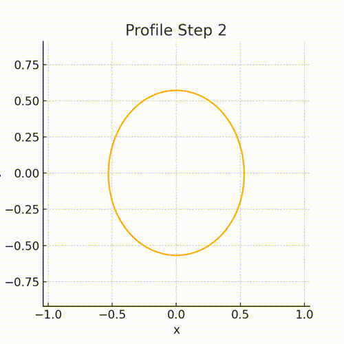

# Hopfion-Radial-Modes

This is just a place where one can access the data, code, and mp4 corresponding to the Fourier mode calculations derived from the membrane formalism. This is referenced in my PhD dissertation. Here is a gif to capture your attention.

